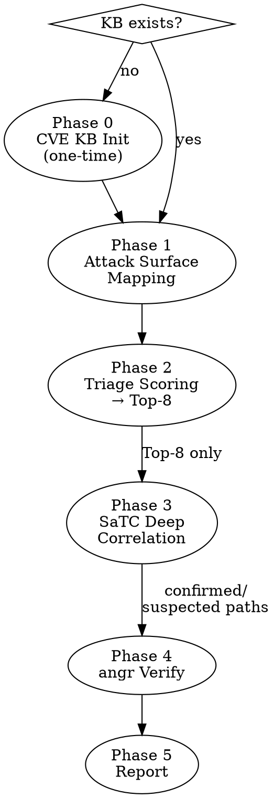

# IoTReaper 2.0 — IoT Firmware Vulnerability Mining

## Overview

Triage-driven 1-day vulnerability mining workflow for MIPS IoT firmware. Assumes filesystem is already extracted (binwalk step done). Uses IDA MCP for static analysis, SaTC-style frontend/backend parameter correlation, and angr for symbolic execution verification.

**IDA MCP server path:** `/Users/yangshuangning/VscodeProjects/ida-mcp-main`

**Hard rules — never skip:**
- Always run Triage (Phase 2) before deep analysis. Never analyze all CGI functions without scoring first.
- Always run angr verification (Phase 4) before declaring a confirmed vulnerability.
- Always check CVE KB (Phase 0) before Phase 1 — it shapes what you look for.

---

## Workflow (5 Phases)



---

## Phase 0: CVE Knowledge Base

**Check first:** `ls ~/.iotreaper/cve_kb.db` — skip init if exists.

**If no network access:** skip NVD crawl, create empty DB, proceed to Phase 1. CVE matching will return no results — rely on Triage scoring only.

**Bootstrap (Python):**
```python
import sqlite3, requests, os

os.makedirs(os.path.expanduser("~/.iotreaper"), exist_ok=True)
db = sqlite3.connect(os.path.expanduser("~/.iotreaper/cve_kb.db"))
db.execute("""CREATE TABLE IF NOT EXISTS cves (
    cve_id TEXT PRIMARY KEY, description TEXT, vendor TEXT,
    product TEXT, vuln_type TEXT, dangerous_func TEXT,
    cvss_score REAL, published TEXT
)""")

# Query NVD API v2 by vendor keyword
for vendor in ["dlink", "tplink", "netgear", "asus", "zyxel"]:
    url = f"https://services.nvd.nist.gov/rest/json/cves/2.0?keywordSearch={vendor}&resultsPerPage=100"
    r = requests.get(url, timeout=30).json()
    for item in r.get("vulnerabilities", []):
        c = item["cve"]
        desc = c["descriptions"][0]["value"] if c.get("descriptions") else ""
        score = (c.get("metrics", {}).get("cvssMetricV31") or [{}])[0].get("cvssData", {}).get("baseScore")
        db.execute("INSERT OR IGNORE INTO cves VALUES (?,?,?,?,?,?,?,?)",
            (c["id"], desc, vendor, "", "", "", score, c.get("published","")))
db.commit()
```

**Query during analysis:**
```python
db.execute("SELECT * FROM cves WHERE product LIKE ? OR description LIKE ?",
           (f"%{binary_name}%", f"%{binary_name}%")).fetchall()
```

---

## Phase 1: Attack Surface Mapping

```bash
FS=<path_to_extracted_filesystem>

# Find MIPS ELF binaries
find $FS -type f | xargs file 2>/dev/null | grep "ELF.*MIPS" | grep -v "shared object"

# Identify web server binary
strings <candidate_binary> | grep -iE "httpd|lighttpd|mini_httpd|boa|goahead" | head -5

# Find CGI handlers
find $FS -path "*/cgi-bin/*" -o -name "*.cgi" 2>/dev/null
strings <httpd_binary> | grep -iE "\.cgi|formHandler|do_|cgi-bin" | sort -u

# Extract version strings for CVE KB lookup
strings <httpd_binary> | grep -iE "version|v[0-9]+\.[0-9]+" | head -20
```

**IDA MCP — start a session with `create_session` (or `probe_ready` to wait for IDA to finish auto-analysis), note the `session_id`, then call:**
- `get_all_function_names` → full function list
- `imports` → flag dangerous imports: `strcpy, sprintf, gets, system, popen, execve, strcat`
- `list_globals` → route strings, version constants

---

## Phase 2: Triage Risk Scoring

Score every CGI function. **Top-8 by score enter Phase 3. Do not skip this step.**

| Signal | IDA MCP Tool | Score |
|--------|-------------|-------|
| Direct call: `strcpy/sprintf/gets/system/popen/execve` | `callees` | +4 each |
| Indirect call (≤2 hops) to dangerous func | `callgraph` | +2 each |
| Name contains: `cmd/exec/upload/ping/debug/tftp/set_` | name match | +3 |
| Stack buffer < 512 bytes | `stack_frame` | +2 |
| CVE KB match (same binary/version) | local KB | +5 |
| Directly reachable from main/dispatch | `xrefs_to` | +2 |
| Body > 100 instructions (complex logic) | `list_funcs` | +1 |

**Risk thresholds:**
- ≥ 6 → **HIGH** → Phase 3
- 3–5 → **MEDIUM** → logged only
- < 3 → **LOW** → excluded

**Top-N:** Default is 8. If fewer than 8 functions score HIGH, take all HIGH ones. Never inflate by including MEDIUM just to reach 8.

**Use IDA MCP `triage` tool first for an overall quick assessment, then score individually.**

---

## Phase 3: SaTC Deep Correlation

### 3.1 Frontend Key Extraction
```bash
# HTML input names
grep -rhoE 'name="([^"]+)"' $FS/www/ 2>/dev/null | sort -u
# URL parameters
grep -rhoE '[?&]([a-zA-Z_][a-zA-Z0-9_]*)=' $FS/www/ 2>/dev/null | sort -u
# JavaScript variables / form fields
grep -rhoE "(\bname\b|\bkey\b)\s*[:=]\s*['\"]([^'\"]+)['\"]" $FS/www/*.js 2>/dev/null
```

**Prioritize semantically dangerous keys:** anything containing `cmd, ip, url, file, upload, pass, ping, exec, debug`.

### 3.2 Backend Key Search (IDA MCP)
```
find_regex(pattern="<key>")          # locate key string in binary
xrefs_to(addr=<string_addr>)        # who references this string?
```

### 3.3 Call Chain Tracing (IDA MCP)
```
callgraph(func=<ref_func>, depth=4)  # who parses this key? (callers)
callees(func=<ref_func>)             # what dangerous func is reached?
```

Check for sanitization on the path: `strlen` bound checks, `strncpy`, regex validation.
- No sanitization → **confirmed** → HIGH confidence
- Sanitization present but possibly bypassable → **suspected** → send to angr
- Complete validation → **excluded** → downgrade to MEDIUM

### 3.4 Decompile Confirmation (IDA MCP)
```
decompile(addr=<func_addr>)
```
Read pseudocode. Confirm user-controlled input reaches dangerous function.

### Finding Object (record per path)
```
Finding #N
  Frontend key : <key>
  Backend entry: <func>(<addr>)
  Dangerous func: <func>(<addr>)
  Call path    : A → B → dangerous_func
  Filter status: none | present (suspected bypass)
  Confidence   : HIGH | MEDIUM
```

---

## Phase 4: angr Symbolic Execution Verification

**Never skip.** Unverified paths are hypotheses, not vulnerabilities. "IDA decompile already shows the bug" is not a substitute — angr provides the reachability proof and concrete PoC.

Generate and run this script per Finding via Bash:

```python
import angr, claripy

BINARY = "<path_to_httpd_or_cgi_binary>"
FUNC_ADDR = <entry_func_addr>          # hex int, e.g. 0x4050A0
DANGEROUS_ADDR = <dangerous_func_addr> # e.g. 0x403210
AVOID_ADDRS = [<sanitize_addr1>, ...]  # empty list [] if no filters
ENDIAN = "MIPS32b"  # big-endian; use "MIPS32l" for little-endian

proj = angr.Project(
    BINARY,
    load_options={"auto_load_libs": False},
    main_opts={"base_addr": 0x400000},
    arch=ENDIAN
)

# Hook MIPS firmware-specific functions angr cannot resolve
for sym in ["nvram_get", "nvram_set", "getenv", "acosNvramConfig_get"]:
    try:
        proj.hook_symbol(sym, angr.SIM_PROCEDURES['stubs']['ReturnUnconstrained']())
    except Exception:
        pass

sym_input = claripy.BVS("user_input", 8 * 512)
state = proj.factory.call_state(
    FUNC_ADDR, sym_input,
    add_options={angr.options.ZERO_FILL_UNCONSTRAINED_MEMORY}
)

simgr = proj.factory.simulation_manager(state)
simgr.explore(find=DANGEROUS_ADDR, avoid=AVOID_ADDRS)

if simgr.found:
    sol = simgr.found[0]
    poc = sol.solver.eval(sym_input, cast_to=bytes)
    print(f"[+] REACHABLE\n[+] PoC: {poc}")
else:
    print("[-] NOT REACHABLE")
```

**MIPS notes:**
- Check firmware endianness: `file <binary>` — "MSB" → `MIPS32b`, "LSB" → `MIPS32l`
- Always `auto_load_libs=False` — MIPS shared libs typically fail to load
- Hook all `nvram_*` and `getenv` variants — these are ubiquitous in router firmware

**Verdict:**
- REACHABLE + PoC → **Confirmed vulnerability** → main report section
- REACHABLE, no PoC → **High-confidence vulnerability** → main report section
- NOT REACHABLE → downgrade, move to excluded

---

## Phase 5: Report

Save to `./iotreaper_report_<YYYYMMDD_HHMMSS>.md`:

```markdown
# IoTReaper Firmware Vulnerability Report
Generated: <timestamp>

## 1. Firmware Overview
| Field | Value |
|-------|-------|
| Architecture | MIPS32 (big/little endian) |
| Web server | <binary name + version> |
| Total CGI functions | <N> |
| Functions analyzed (Top-8) | 8 |

## 2. CVE Knowledge Base Matches
| CVE ID | Product | Type | CVSS | Summary |

## 3. CGI Interface Inventory
| Rank | Function | Score | Risk | Key Signals |

## 4. Vulnerability Findings

### Finding #N: <VulnType> in <FunctionName>
- **Description**: <what and why>
- **Frontend key**: `<param_name>`
- **Call chain**: `funcA → funcB → system()`
- **Pseudocode excerpt**:
  ```c
  <relevant snippet from decompile>
  ```
- **angr result**: REACHABLE — PoC: `<bytes>`
- **Related CVE**: CVE-XXXX-XXXXX (if matched)
- **Remediation**: Replace `strcpy` with `strncpy`; validate input length before use.

## 5. Appendix: Excluded Items
| Function | Score | Reason |
```

---

## IDA MCP Quick Reference

All calls share a single `session_id` for the entire analysis run.

| Phase | Tools |
|-------|-------|
| 1 | `get_all_function_names`, `imports`, `list_globals` |
| 2 | `triage`, `callees`, `callgraph`, `stack_frame`, `xrefs_to`, `list_funcs` |
| 3 | `find_regex`, `xrefs_to`, `callgraph`, `callees`, `decompile` |
| 4 | `basic_blocks` (optional CFG hints for angr) |
| Modify | `rename`, `set_comments` (annotate findings inline in IDA) |

---

## Common Mistakes

| Mistake | Fix |
|---------|-----|
| Analyzing all functions without Triage | Always score first, take Top-8 only |
| Using x86 angr config on MIPS firmware | Check `file <binary>` endianness, set `arch=MIPS32b/l` |
| Forgetting to hook `nvram_get` | angr will crash or return wrong results on router firmware |
| Reporting unverified `strcpy` calls as vulns | Phase 4 is mandatory before declaring a confirmed finding |
| Only checking backend strings, skipping frontend | Phase 3.1 frontend grep is required — some params only appear in JS |
| Running CVE KB query without vendor filtering | Filter by exact vendor string to avoid false matches |
